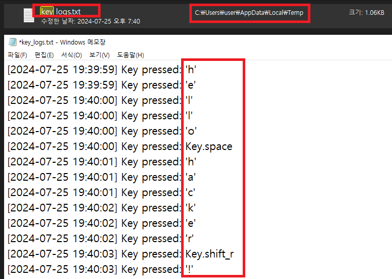
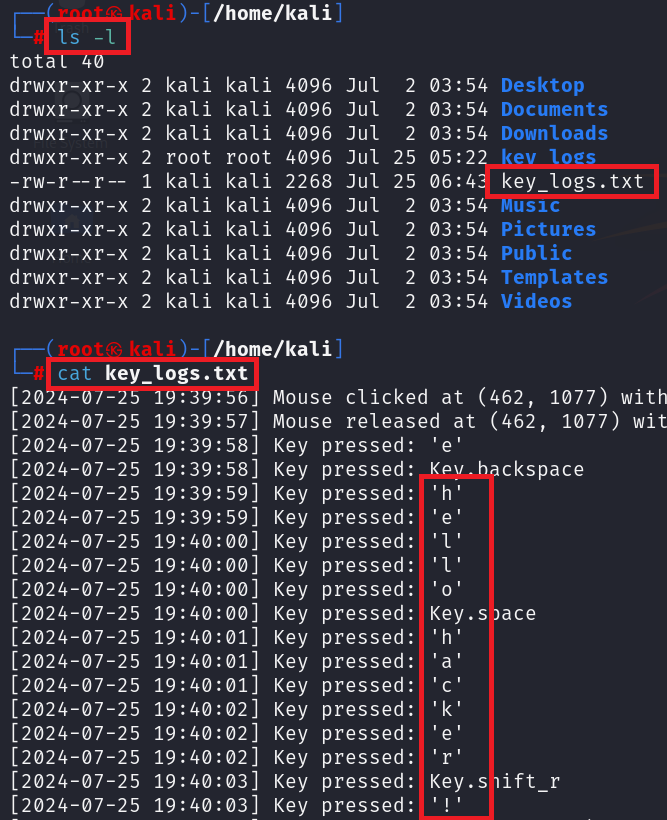

# KeyLogger

- 해당 스크립트가 실행되는 환경이 Windows 혹은 MacOS 인지 파악 후, 각 OS 환경에 맞는 임시 폴더에 키로깅 정보가 저장되고, 공격자의 FTP 서버로 해당 키로깅 정보가 담긴 파일이 전송된다.

# Examples

**수행 환경:**

- 공격자: Kali Linux(192.168.0.32)
- 피해자: Windows 10(192.168.0.10)

1. 피해자 PC에서 `keylogger.py` 스크립트 실행

2. **"hello hacker!"** 입력 후, 피해자 PC의 OS인 Windows의 임시 폴더(**C:\Users\user\AppData\Local\Temp**)에 해당 정보가 포함된 파일(**key_logs.txt**)이 생성 되었는지 확인

3. 해당 파일이 **공격자의 FTP 서버**로 전송되었는지 확인

# Disclaimer

해당 도구는 오로지 학습 목적으로 제작되었습니다. 해당 도구는 오로지 테스트 환경에서만 사용해야 하며, 그 이외의 행위에 대해서는 법적 책임을 야기할 수 있습니다.